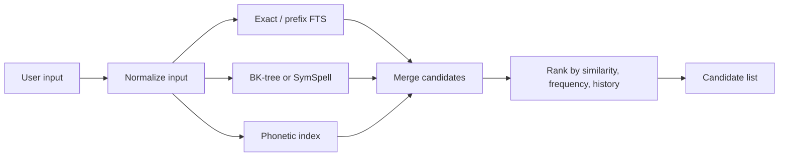

# Mac Dictionary App Design

## Product Positioning

一个轻量、现代、偏工具型的 macOS 词典 App：输入可能拼错的单词时，先召回相似词；确认后展示可靠的释义、音标、发音、例句和记忆辅助；所有查过的词自动进入历史和复习流。

核心原则：

- 本地优先：查词、模糊匹配、历史记录、复习都应离线可用。
- 无 token 默认消耗：基础能力不依赖 LLM，不因日常查词产生 token/API 成本。
- 来源可信：释义和例句优先来自开放词典/语料，避免每次请求大模型。
- 响应极快：打开、输入、回车展示结果都应接近 Spotlight/Raycast 的速度。
- 视觉克制：像一个常驻的高品质 macOS 工具，而不是学习平台首页。

## Offline And Online Boundary

基础能力必须离线可用：

- 查词和近似词召回
- 单词释义
- 音标展示
- 系统 TTS 发音
- 例句展示
- 查询历史
- 收藏
- 复习卡片
- 本地规则生成的记忆辅助

允许联网的增强能力：

- 下载或更新词典数据包
- 下载 Wiktionary/Kaikki 等来源提供的真人发音音频
- 查询更长尾的新词、俚语、专有名词或术语
- 获取更多例句或语料补充
- 可选云端 TTS
- 可选 AI 记忆增强、易混词解释、语境化例句
- 多设备同步

默认策略：

- 所有联网增强默认关闭或按需触发。
- 任何可能产生费用、token 或 API 调用的能力，都必须在设置中明确标注。
- 联网返回的内容应写入本地缓存，避免重复请求。
- 当离线数据已足够回答时，不应请求网络。

## Primary User Flow

1. 用户通过快捷键唤起浮窗，例如 `Option + Space`。
2. 输入单词或近似拼写。
3. App 实时展示候选词列表，按相似度、词频、历史偏好排序。
4. 用户按 `Enter` 或点击候选词。
5. 右侧或详情页展示：
   - 单词、词性、音标
   - 可点击音标/喇叭按钮发音
   - 核心中文/英文释义
   - 例句与来源
   - 词根/联想/拆分记忆
   - 最近查询时间、收藏、熟悉度
6. 查询自动进入历史；用户可在 Review 页面按时间或遗忘曲线复习。

## Information Architecture

- Lookup：默认页，搜索和解释详情。
- History：按日期、频率、收藏筛选查过的词。
- Review：待复习词卡，支持 `Know / Unsure / Forgot`。
- Settings：词典源、发音源、快捷键、是否启用 AI 记忆增强。

## Interface Design

### Main Window

建议使用单窗口双栏布局：

- 左栏宽约 280-340px：搜索框、候选列表、最近查询。
- 右栏自适应：单词详情。
- 顶部只保留搜索输入和少量状态，不做厚重导航。
- 空状态展示最近词和收藏词，不放营销文案。

视觉方向：

- 背景：macOS 原生浅灰/深灰材质感，支持深色模式。
- 卡片：少用大卡片；详情区用分组和细分割线。
- 字体：SF Pro 为主；音标和例句可用略带学术感的 serif fallback。
- 强调色：低饱和蓝绿色或系统 accent color，不做大面积渐变。
- 动效：候选切换和详情加载 120-180ms 淡入；发音按钮轻微反馈即可。

### Candidate List

每个候选项展示：

- headword
- 简短释义
- 相似度提示，例如 “spelling close”
- 如果是历史词，显示小型时钟图标

排序建议：

```text
score = editSimilarity * 0.45
      + phoneticSimilarity * 0.20
      + prefixMatch * 0.15
      + logFrequency * 0.10
      + userHistoryBoost * 0.10
```

### Detail View

信息优先级：

1. 单词 + 音标 + 发音按钮
2. 最常用释义
3. 词性分组释义
4. 例句
5. 记忆辅助
6. 词源、同反义、派生词等进阶信息

音标区域交互：

- 点击音标或喇叭：播放发音。
- `Space`：重复播放当前选中词。
- 支持美音/英音切换，但默认只显示一个简洁 toggle。

## Dictionary Data

推荐数据源组合：

### Definitions

首选组合：

- WordNet：稳定、离线、结构化，适合英文释义、词性、同义词和部分例句。
- Wiktionary via Wiktextract/Kaikki：覆盖更广，可获得音标、词形、释义、发音链接、例句等结构化数据。

落地方式：

- 构建时下载/转换开放数据，生成本地 SQLite 数据库。
- App 首次启动不应在线拉词典；数据应随 App 或增量包发布。
- 词条表保留 `source` 字段，详情页可以低调展示来源。

### Example Sentences

推荐来源：

- WordNet gloss examples：与释义绑定，质量稳定但数量有限。
- Tatoeba：开放例句库，覆盖广，但需要过滤质量和长度。

例句筛选：

- 优先包含目标词原形或词形变化。
- 长度控制在 8-24 个英文词。
- 排除专名过多、标点异常、翻译不完整的句子。
- 每个词默认展示 2-3 条，更多折叠。

## Fuzzy Search

本地索引建议：

- SQLite FTS5：前缀、token、快速搜索。
- BK-tree：编辑距离召回拼写相近词。
- SymSpell：高性能拼写纠错，适合输入错误较多的场景。
- Double Metaphone 或 Soundex：补充发音相近召回。

查询流程：



## Pronunciation

推荐分层策略：

1. macOS `AVSpeechSynthesizer`：作为默认本地朗读，无需网络，隐私好，稳定。
2. 词典自带音频：若 Wiktionary/Kaikki 提供音频链接，可下载缓存，质量通常更像真人发音。
3. 云端 TTS 插件：
   - Microsoft Azure Speech SDK：成熟，跨平台，音色多，Swift/macOS 可集成。
   - Doubao/Volcengine TTS：中文环境接入友好，但通常是云服务，建议作为可选 provider，而不是默认离线方案。

App 内抽象：

```swift
protocol SpeechProvider {
    var id: String { get }
    func speak(word: String, locale: Locale, voice: VoiceOption?) async throws
}
```

默认实现：

- `SystemSpeechProvider`：调用 macOS 原生语音。
- `CachedAudioProvider`：播放词典音频缓存。
- `AzureSpeechProvider` / `VolcengineSpeechProvider`：用户配置 API key 后启用。

## Memory Aid

记忆辅助应缓存，不应每次查询实时调用大模型。

生成策略：

- 先用本地规则生成基础内容：
  - 词根词缀拆解
  - 相似词提醒
  - 常见搭配
  - 易混词比较
- 用户开启 AI 增强后，后台生成一次并写入本地数据库。
- AI 输出必须绑定词条版本和模型版本，避免重复生成。

记忆辅助内容建议：

- “拆”：possible = poss + ible
- “联”：把单词和一个具体画面关联
- “辨”：与 `possibly`、`probable` 等词对比
- “用”：给一个最常见搭配

## History And Review

历史记录字段：

- `word_id`
- `query_text`
- `selected_headword`
- `looked_up_at`
- `source`
- `duration_ms`
- `is_favorite`
- `familiarity`

复习字段：

- `last_reviewed_at`
- `next_review_at`
- `stability`
- `difficulty`
- `review_count`

复习算法：

- MVP 可用 SM-2。
- 后续可换 FSRS，效果更现代，参数也更适合长期复习。

Review 页面交互：

- 卡片正面：单词 + 发音。
- 卡片背面：核心释义 + 例句 + 记忆辅助。
- 三个按钮：Know / Unsure / Forgot。

## Technical Architecture

推荐栈：

- App：SwiftUI + AppKit bridge
- Storage：SQLite
- Search：SQLite FTS5 + SymSpell/BK-tree
- Speech：AVFoundation + optional cloud providers
- Data pipeline：Python scripts convert WordNet/Wiktionary/Tatoeba into SQLite
- Sync later：CloudKit 或本地导入导出，MVP 先不做账号系统

模块：

```text
App
  UI
    Lookup
    History
    Review
    Settings
  Domain
    DictionaryEntry
    SearchCandidate
    ReviewCard
  Services
    DictionaryStore
    SearchService
    SpeechService
    ReviewScheduler
    MemoryAidService
  DataPipeline
    import_wordnet.py
    import_wiktionary.py
    import_tatoeba.py
```

## Data Model

核心表：

```sql
CREATE TABLE words (
  id INTEGER PRIMARY KEY,
  headword TEXT NOT NULL,
  normalized TEXT NOT NULL,
  frequency REAL DEFAULT 0,
  source_mask INTEGER DEFAULT 0
);

CREATE TABLE senses (
  id INTEGER PRIMARY KEY,
  word_id INTEGER NOT NULL,
  part_of_speech TEXT,
  definition TEXT NOT NULL,
  source TEXT NOT NULL,
  rank INTEGER DEFAULT 0
);

CREATE TABLE pronunciations (
  id INTEGER PRIMARY KEY,
  word_id INTEGER NOT NULL,
  ipa TEXT,
  dialect TEXT,
  audio_url TEXT,
  audio_cache_path TEXT,
  source TEXT
);

CREATE TABLE examples (
  id INTEGER PRIMARY KEY,
  word_id INTEGER NOT NULL,
  sentence TEXT NOT NULL,
  translation TEXT,
  source TEXT NOT NULL,
  quality_score REAL DEFAULT 0
);

CREATE TABLE lookup_history (
  id INTEGER PRIMARY KEY,
  word_id INTEGER,
  query_text TEXT NOT NULL,
  selected_headword TEXT,
  looked_up_at TEXT NOT NULL,
  is_favorite INTEGER DEFAULT 0
);

CREATE VIRTUAL TABLE words_fts USING fts5(
  headword,
  normalized,
  content='words',
  content_rowid='id'
);
```

## MVP Scope

第一版建议只做这些：

- 全局快捷键唤起查询窗口
- 本地词典 SQLite
- 拼写相似候选召回
- 单词详情：释义、音标、例句、发音
- 查询历史
- 收藏
- 基础复习卡片
- 系统 TTS

当前原型已实现：

- SwiftUI macOS App 骨架
- Bundled SQLite 离线词库，当前由 WordNet 3.0 + ECDICT 生成
- 447k+ offline word entries、612k+ senses、79k+ examples
- 英到中：ECDICT 中文释义和音标
- 英到英：WordNet 英文释义和例句
- 搜索候选召回已下沉到 SQLite FTS/prefix 查询，少量候选再做 typo rerank
- 详情按需从 SQLite 加载
- seed SQLite、WordNet SQLite、ECDICT merge 生成脚本
- 拼写相似候选召回
- 默认空查询状态：启动后不展示候选和词条
- 确认候选后，搜索框替换为选中的 headword
- 详情页：英中释义、英英释义、音标、例句、记忆辅助分区展示，并标注来源
- WordNet 例句按当前 headword 过滤，避免展示只属于同义词的例句
- 解释区英文单词双击查询：双击释义/例句/助记里的英文词，跳转到该词条
- 点击朗读：macOS 系统 TTS
- 查询历史本地持久化
- 收藏和基础复习视图

增强功能免费数据源规划：

- 例句：当前 WordNet；后续可离线导入 Tatoeba。
- 助记：先使用本地词根/词缀规则与缓存文本，不默认调用 LLM。
- 词根：ECDICT `wordroot.txt` + 本地规则。
- 词源：Wiktionary via Wiktextract/Kaikki。
- 搭配：本地语料统计优先；可选免费 API 必须缓存且默认关闭。
- 同义词：WordNet synsets/relations。
- 形近词：ECDICT `resemble.txt` + 编辑距离。
- 替换：WordNet 同义词 + 语境无关的基础替换建议。
- 单词新解：不做默认 AI 生成；可用 Wiktionary usage notes 或本地缓存。
- 派生词：WordNet derivationally related forms + ECDICT exchange/lemma。

中到英计划：

- 保留当前 SQLite schema，增加 dictionary direction/source metadata。
- 接入 CC-CEDICT 作为独立 `zh-en` 词典包。
- UI 搜索时按输入字符自动判断英文/中文，中文输入走中文 headword/拼音/简繁归一化召回。
- 中英功能仍遵守 offline-first/no-token-by-default。

第二阶段：

- Wiktionary 音频缓存
- AI 记忆辅助离线缓存
- FSRS 复习
- Menu bar quick lookup
- iCloud/CloudKit 同步

## Open Questions

- 目标词库范围：只做英汉/英英，还是也要中英、日语等？
- UI 语言：中文界面优先，还是英文界面？
- 是否需要导入已有生词本，例如欧路词典、Anki、CSV？
- 是否接受云端 TTS，还是必须完全离线？

## Reference Sources

- WordNet: https://wordnet.princeton.edu/
- Wiktextract: https://github.com/tatuylonen/wiktextract
- Kaikki Wiktionary data: https://kaikki.org/
- Tatoeba: https://tatoeba.org/
- Microsoft Azure Speech SDK: https://learn.microsoft.com/azure/ai-services/speech-service/
- Apple AVSpeechSynthesizer: https://developer.apple.com/documentation/avfaudio/avspeechsynthesizer
- Doubao/Volcengine TTS: https://www.volcengine.com/product/tts
